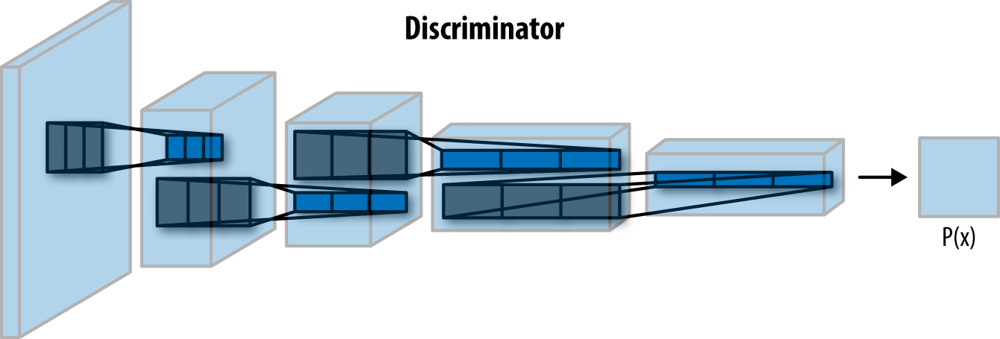
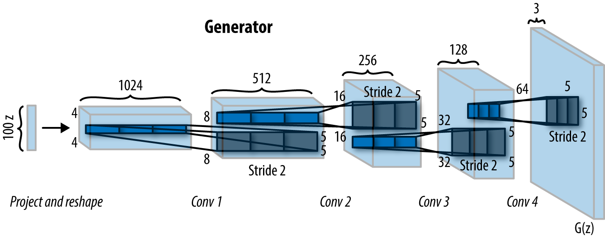

# Biweekly Progress Report Iteration #2

Date : (  )

<mark>[ :white_check_mark: Completed ] [ :stopwatch: Time Approx ] [ :computer: Implementaiton | :spiral_notepad: Documentation ] </mark>

- [x] [ ] Convolution Operation & CNN Concepts

- [x] [ ] Deep Convolution Gan Paper ( Implementation )

- [ ] [ ] Observation on Different Datasets
  
  - [ ] [ ] MNIST
  
  - [ ] [ ] CelebA
  
  - [ ] [ ] Art Datasets

- [ ] [ ] Optimization Techniques

- [ ] [ ] Conclusion

- [ ] [ ] Model for next Iteration ( WasserStein GAN )

****

## Convolution

Convolution operation combines two functions  ( like sum or multiplication operation ) and outputs third function :

- **Continuous** Input $x$ and Kernel $w$ 

$$
\boxed{ s(t) = (x \circledast w)(t) = \int x(a)w(t-a)da}
$$

- **Discrete t :**

$$
\boxed{ s(t) = (x \circledast w)(t) = \displaystyle\sum_{a} x(a)w(t-a) }
$$

#### Properties:

- Commutative : $f(x) \circledast g(x) = g(x) \circledast f(x)$

- Associative : $(f(x) \circledast g(x) \circledast h(x)) = f(x) \circledast (g(x) \circledast h(x))$

- Distributive : $f(x) \circledast (g(x) + h(x)) = f(x) \circledast g(x) + f(x) \circledast h(x)$

- Circularity, Identity etc.

## Convolutional Neural Networks

- In CNN terms $S$  is : `Feature Map`

- Cross-correlation is same as convolution with flipped kernel( if kernel = symmetric )

- Most practical application of CNN use Cross-correlation instead of Convolutions due to it's simplicity

- Different Kernels can be used to highlights different features from images.

- Convolution layers provide Local Connectivity  and Spatial kernel parameter sharing on top of Multilayer Perceptron( Fully Connected Networks )

#### Terminologies ( CNN )

**Stride :** Applying the filter with different step size on Image patches (e.g. Stride =2 with shift the filter 2 steps forward )

**Padding :** Extending image borders ( Mostly with value '0')

**Pooling/ Subsampling** : Reducing parameters/ make representations smaller ( Max | Average Pooling)

# Deep Convolutional GAN

The idea/guidelines proposed in this paper [[Ref 1.]](https://arxiv.org/pdf/1511.06434.pdf) 

- Use of Convolutional layers instead of fully connected hidden layers for deep architectures

- Replacing any pooling layers with strided convolutions (discriminator) and fractional-strided convolutions (generator).

- Using batchnorm in both the generator and the discriminator.

- Using ReLU activation in generator for all layers except for the output, which uses tanh.

- Using LeakyReLU activation in the discriminator for all layer.

## Discriminator Architecture

 

## Generator

## References :

- [1. ] [Unsupervised Representation Learning with Deep Convolutional Generative Adversarial Networks](https://arxiv.org/pdf/1511.06434.pdf)
