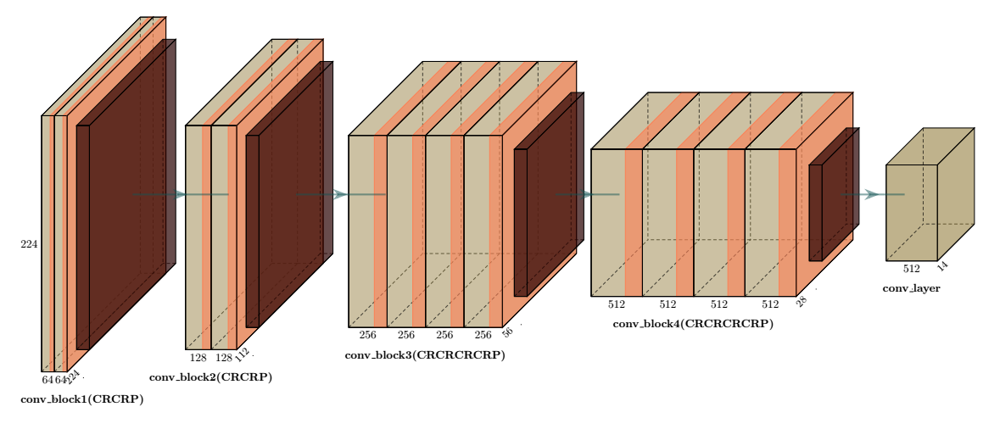
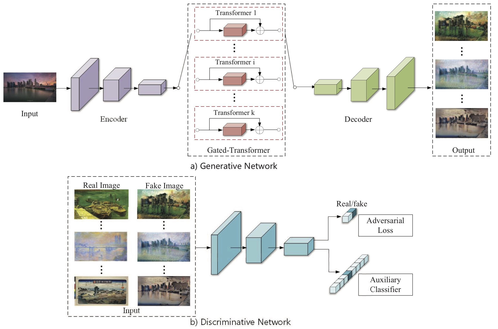

# Style Based Generation

## Neural Style Transfer using VGG-19

**Steps:**

1. Define `CONTENT_IMG` and `STYLE_IMG` in `style_transfer.py`
2. Run `python style_transfer.py`
## Multi-Collection Style Transfer [ Gated-GAN ]

**Steps:**

1. Change hyperparameters if necessary in `train.py`
2. Run `python train.py`
3. Extract `Observations.zip` -> `Observation.ipynb`
4. Provide sample image_path in `Observation.ipynb`
5. Use interactive ipynb widgets to transfer/mix style.

***