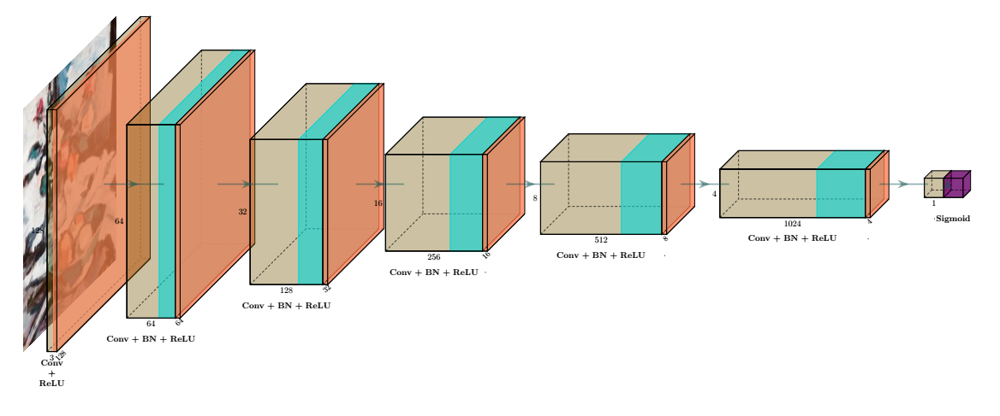
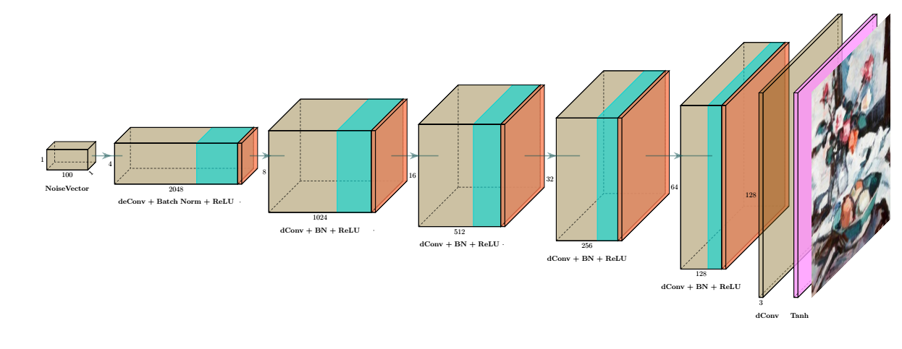
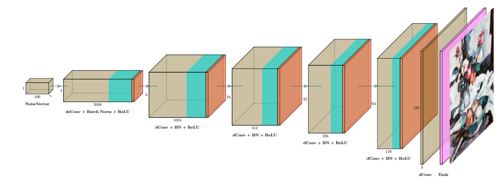

# Unconditional Generative Network Architectures

**Steps for training and observations :**

1. Change parameters in `train.py` if necessary
2. Run `python train.py` for each network
3. Run Tensorboard Logging as : `tensorboard --logdir=./log_directory`

## Fully Connected MLP-GAN

**Discriminator**

**Generator**

## Deep Convolution GAN

**Discriminator**

**Generator**

## Wasserstein GAN

**Discriminator**

**Generator**

***